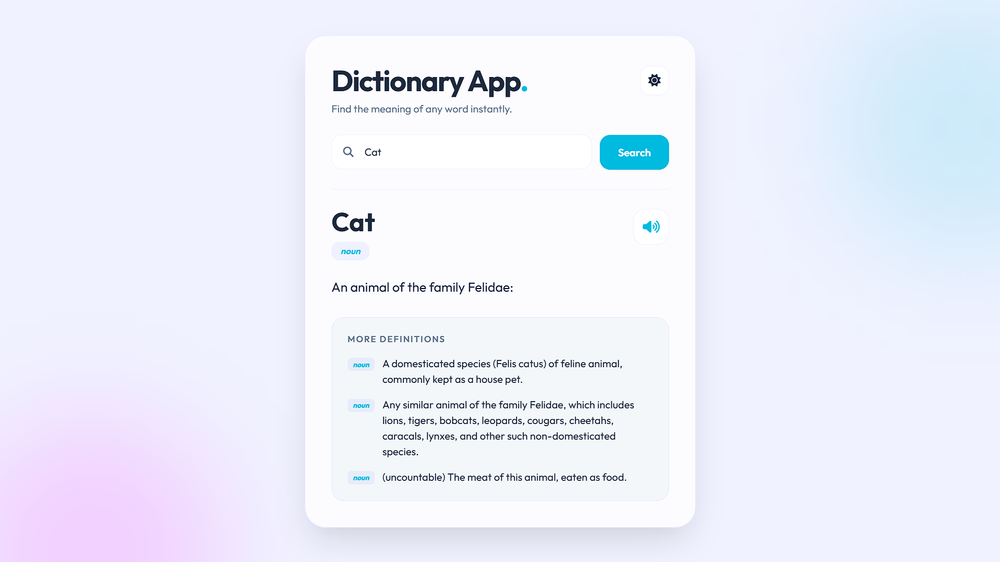
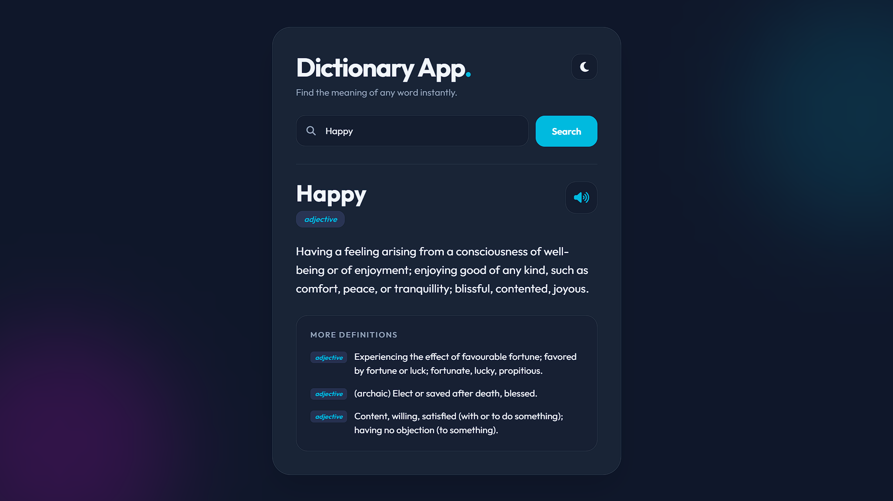

# 📘 Dictionary App

A modern, responsive **Dictionary Web App** built with **HTML, CSS and Vanilla JavaScript**.  
It allows users to instantly search word meanings with a clean UI, dark/light theme support and pronunciation feature.

---

## ✨ Features

- 🔍 Instant word search
- 🌙 Dark / ☀️ Light theme (saved with LocalStorage)
- 🔊 Text-to-Speech pronunciation
- 🎨 Modern glassmorphism UI
- 📱 Fully responsive design
- ⚡ Fast & lightweight (Vanilla JS)

---

## 🖼️ Screenshots

### Light Mode


### Dark Mode


---

## 🚀 Live Demo

If deployed with GitHub Pages or Vercel:  
`https://your-username.github.io/dictionary-app/`

---

## 🛠️ Technologies Used

- HTML5
- CSS3 (Glassmorphism, Animations, Responsive Design)
- JavaScript (ES6)
- Datamuse Dictionary API
- Web Speech API

---

## 📂 Project Structure

```txt
dictionary-app/
│
├─ index.html
├─ style.css
├─ script.js
├─ assets/
│   └─ screenshots/
└─ README.md
